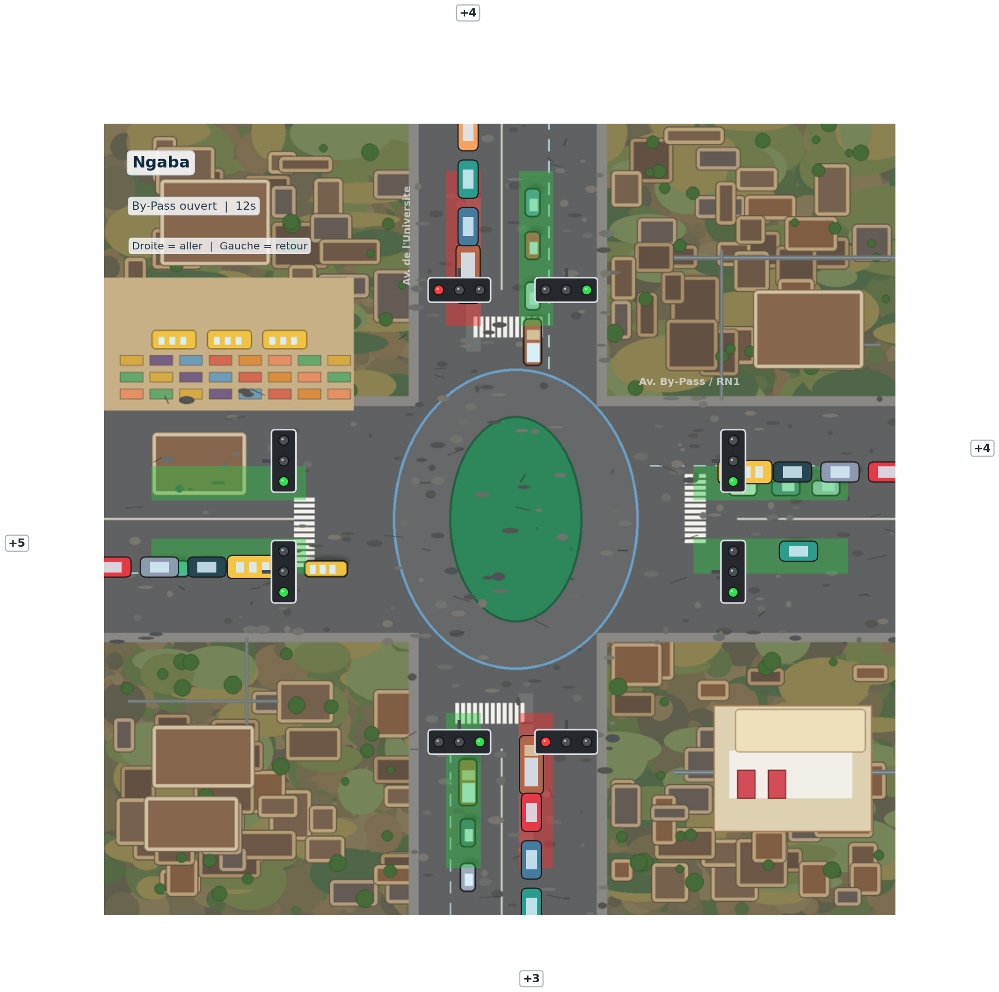

# Gestion du trafic au rond-point Ngaba

Simulateur temps reel du rond-point Ngaba developpe en `C++17` avec `Qt Widgets`.

Ce projet a ete realise dans le cadre d'un cours de systemes informatiques temps reel. Il met en scene la circulation au rond-point Ngaba, la gestion des phases de feux, les files d'attente de vehicules et un rendu visuel inspire de la geometrie reelle du site.



## Objectif du projet

L'application permet de :

- simuler un carrefour de type rond-point en temps reel ;
- gerer les phases de signalisation avec adaptation du trafic ;
- visualiser les flux `aller` et `retour` sur les differentes branches ;
- illustrer une implementation concrete en `C++/Qt` pour un projet academique.

## Fonctionnalites principales

- simulation graphique du rond-point Ngaba en plein ecran de travail ;
- 8 feux de signalisation positionnes autour de l'intersection ;
- distinction visuelle des voies `aller` et `retour` ;
- animation des vehicules sur les axes principaux ;
- moteur de simulation separe de l'interface ;
- architecture exploitable dans `Qt Creator` ;
- scripts PowerShell pour compiler et lancer rapidement le projet.

## Technologies utilisees

- `C++17`
- `Qt 6 Widgets`
- `CMake`
- `MSYS2 / MinGW-w64`
- `PowerShell`

## Structure du depot

```text
gestion_trafic_rond_point_ngaba/
|-- assets/
|   `-- ngaba_satellite_style.png
|-- docs/
|   |-- CAHIER_DES_CHARGES_NGABA.md
|   |-- SPECIFICATION_SA_RT_NGABA.md
|   |-- CONCEPTION_DARTS_NGABA.md
|   `-- DOSSIER_CONCEPTION_NGABA.md
|-- src/
|   |-- main.cpp
|   |-- MainWindow.h / MainWindow.cpp
|   |-- SimulationEngine.h / SimulationEngine.cpp
|   |-- TrafficModel.h / TrafficModel.cpp
|   `-- IntersectionWidget.h / IntersectionWidget.cpp
|-- build.ps1
|-- run.ps1
|-- CMakeLists.txt
`-- README.md
```

## Architecture du code

- `main.cpp`
  Point d'entree de l'application Qt.

- `MainWindow.*`
  Fenetre principale qui heberge la simulation.

- `SimulationEngine.*`
  Boucle de simulation, chronometrage, cycle des phases et mise a jour des etats.

- `TrafficModel.*`
  Modele metier du trafic : branches, mouvements, files, phases, routes et regles d'ecoulement.

- `IntersectionWidget.*`
  Rendu graphique du rond-point, des vehicules, du fond satellite et des feux.

## Livrables academiques

Le depot contient les livrables demandes pour le cours :

- [Cahier des charges](docs/CAHIER_DES_CHARGES_NGABA.md)
- [Specification SA-RT](docs/SPECIFICATION_SA_RT_NGABA.md)
- [Conception DARTS](docs/CONCEPTION_DARTS_NGABA.md)
- [Dossier de conception](docs/DOSSIER_CONCEPTION_NGABA.md)
- Implementation du simulateur en `C++/Qt`

## Prerequis

Environnement recommande :

- Windows
- `MSYS2` installe dans `C:\msys64`
- `Qt 6 Widgets`
- `g++.exe`
- `pkg-config.exe`
- `moc.exe`
- `Qt Creator` si vous souhaitez ouvrir le projet en IDE

Chemins utilises sur la machine de developpement :

- `C:\msys64\mingw64\bin\g++.exe`
- `C:\msys64\mingw64\bin\pkg-config.exe`
- `C:\msys64\mingw64\share\qt6\bin\moc.exe`
- `C:\msys64\mingw64\bin\qtcreator.exe`

## Cloner le projet depuis GitHub

Depot GitHub :

```text
https://github.com/nkishiged/gestion_de_traffic_rond_point_ngaba
```

Depuis PowerShell :

```powershell
git clone https://github.com/nkishiged/gestion_de_traffic_rond_point_ngaba.git
cd gestion_de_traffic_rond_point_ngaba
```

Si `git` n'est pas encore installe sur la machine :

1. installer Git for Windows ;
2. rouvrir PowerShell ;
3. relancer les commandes ci-dessus.

## Demarrage rapide

Depuis PowerShell, placez-vous a la racine du projet puis executez :

```powershell
.\build.ps1
.\run.ps1
```

En resume, pour quelqu'un qui part de zero :

```powershell
git clone https://github.com/nkishiged/gestion_de_traffic_rond_point_ngaba.git
cd gestion_de_traffic_rond_point_ngaba
.\build.ps1
.\run.ps1
```

## Compilation manuelle avec CMake

Si vous preferez CMake directement :

```powershell
$env:PATH = 'C:\msys64\mingw64\bin;' + $env:PATH
C:\msys64\mingw64\bin\cmake.exe -S . -B build -G Ninja -DCMAKE_PREFIX_PATH="C:/msys64/mingw64" -DCMAKE_CXX_COMPILER="C:/msys64/mingw64/bin/g++.exe"
C:\msys64\mingw64\bin\cmake.exe --build build
```

## Ouverture dans Qt Creator

1. Lancez `Qt Creator`.
2. Ouvrez le fichier `CMakeLists.txt`.
3. Selectionnez un kit `Desktop Qt 6`.
4. Verifiez que le compilateur pointe bien vers `C:\msys64\mingw64\bin\g++.exe`.
5. Executez le projet avec `Run`.

Ou directement :

```powershell
C:\msys64\mingw64\bin\qtcreator.exe CMakeLists.txt
```

## Recuperer les mises a jour du depot

Si le projet existe deja sur la machine et que vous voulez recuperer la derniere version :

```powershell
cd gestion_de_traffic_rond_point_ngaba
git pull
```

Ensuite, si necessaire :

```powershell
.\build.ps1
.\run.ps1
```

## Travailler avec Git

Verifier l'etat du depot :

```powershell
git status
```

Ajouter les changements :

```powershell
git add .
```

Creer un commit :

```powershell
git commit -m "Mise a jour du simulateur Ngaba"
```

Envoyer les changements sur GitHub :

```powershell
git push
```

## Telechargement sans Git

Si vous ne souhaitez pas utiliser `git`, vous pouvez aussi :

1. ouvrir le depot GitHub ;
2. cliquer sur `Code` ;
3. choisir `Download ZIP` ;
4. extraire l'archive ;
5. ouvrir le dossier du projet ;
6. lancer `.\build.ps1` puis `.\run.ps1`.

## Controles dans l'application

- `Espace` : pause / reprise de la simulation
- `R` : reinitialisation

## Sortie generee

Le script de build produit l'executable suivant :

```text
build-manual\gestion_trafic_rond_point_ngaba.exe
```

## Notes importantes

- L'ancien prototype Python a ete retire du projet.
- Le depot est maintenant centre sur une implementation `C++/Qt`.
- Le rendu visuel est base sur une vue inspiree du rond-point Ngaba avec fond satellite.
- La simulation et l'interface occupent toute la fenetre principale.

## Etat du projet

- migration vers `C++` terminee ;
- interface `Qt Widgets` operationnelle ;
- build et lancement valides via scripts PowerShell ;
- depot pret a etre publie sur GitHub comme projet academique.

## Auteur / Contexte

Projet realise dans le cadre du cours de systemes informatiques temps reel autour de la modelisation et de la simulation du rond-point Ngaba.
