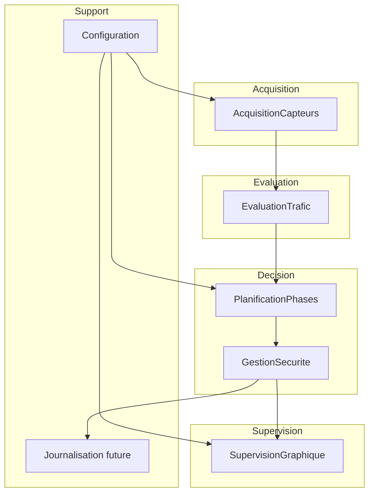

# Conception du systeme selon la methode DARTS

## 1. Objet

Ce document presente la conception du systeme de gestion du trafic du rond-point
Ngaba selon la methode DARTS, en mettant l'accent sur la structuration temps reel,
la decomposition en taches et les interactions entre composants.

## 2. Principe de DARTS applique au projet

La methode DARTS conduit a passer de l'analyse fonctionnelle a une architecture
logicielle organisee en taches cooperantes ou concurrentes. Dans le cadre du
prototype Ngaba, l'objectif est de definir clairement:

- les taches,
- leurs responsabilites,
- leurs activations,
- leurs echanges,
- leurs contraintes temporelles.

## 3. Vue d'ensemble de l'architecture

## 4. Decomposition en taches

### 4.1 Tache `AcquisitionCapteurs`

Role:
- recevoir ou simuler les entrees de trafic,
- normaliser les donnees d'entree.

Entrees:
- horloge logique,
- parametres de simulation.

Sorties:
- mesures de trafic par mouvement.

Implementation prototype:
- generation d'arrivees dans [carrefour.py](/i:/COURS/2ICI/SITR/gestion_trafic_rond_point_ngaba/carrefour.py).

### 4.2 Tache `EvaluationTrafic`

Role:
- calculer les files par branche,
- produire les charges globales utiles a la commande.

Entrees:
- trafic courant.

Sorties:
- files,
- charges agregees.

Implementation prototype:
- fonctions de calcul dans [carrefour.py](/i:/COURS/2ICI/SITR/gestion_trafic_rond_point_ngaba/carrefour.py).

### 4.3 Tache `PlanificationPhases`

Role:
- choisir la phase a appliquer,
- calculer la duree adaptee,
- decider d'une prolongation eventuelle.

Entrees:
- trafic evalue,
- phase courante,
- temps restant.

Sorties:
- prochaine commande de phase,
- duree de phase.

Implementation prototype:
- logique de phase dans [carrefour.py](/i:/COURS/2ICI/SITR/gestion_trafic_rond_point_ngaba/carrefour.py).

### 4.4 Tache `GestionSecurite`

Role:
- imposer les transitions sures,
- garantir l'absence de vert incompatible.

Entrees:
- demande de changement de phase.

Sorties:
- phase validee et sure.

Implementation prototype:
- machine de phase et etats `ORANGE` / `SECURITE`.

### 4.5 Tache `SupervisionGraphique`

Role:
- dessiner le carrefour,
- afficher feux, vehicules et informations de contexte,
- permettre l'observation du scenario.

Entrees:
- trafic,
- phase,
- temps restant,
- mouvements autorises,
- cycle.

Sorties:
- fenetre de supervision.

Implementation prototype:
- rendu Matplotlib dans [visualisation.py](/i:/COURS/2ICI/SITR/gestion_trafic_rond_point_ngaba/visualisation.py).

### 4.6 Tache `OrchestrationSimulation`

Role:
- enchainer les pas de temps,
- coordonner la decision et l'affichage.

Implementation prototype:
- boucle principale dans [simulation.py](/i:/COURS/2ICI/SITR/gestion_trafic_rond_point_ngaba/simulation.py).

## 5. Mode d'activation des taches

| Tache | Type d'activation | Frequence / declenchement |
| --- | --- | --- |
| `AcquisitionCapteurs` | periodique | a chaque pas logique |
| `EvaluationTrafic` | periodique | apres acquisition |
| `PlanificationPhases` | periodique + evenementielle | a chaque pas et a chaque fin de phase |
| `GestionSecurite` | evenementielle | lors des transitions |
| `SupervisionGraphique` | periodique | a chaque mise a jour visuelle |
| `OrchestrationSimulation` | periodique | pilote l'ensemble |

## 6. Communications inter-taches

### 6.1 Flux logiques

- `AcquisitionCapteurs` -> `EvaluationTrafic`: trafic courant
- `EvaluationTrafic` -> `PlanificationPhases`: charges et files
- `PlanificationPhases` -> `GestionSecurite`: demande de transition
- `GestionSecurite` -> `SupervisionGraphique`: etat des feux valide
- `OrchestrationSimulation` -> toutes les taches: rythme du cycle

### 6.2 Nature des communications

Dans le prototype actuel, les communications sont realisees par appels de fonctions et
partage de structures Python simples. Dans une version temps reel plus aboutie, elles
pourraient prendre la forme de files de messages, boites aux lettres ou buffers
proteges.

## 7. Synchronisation

Le prototype adopte une synchronisation sequentielle simple:

1. lire ou produire le trafic,
2. evaluer les charges,
3. choisir les mouvements autorises,
4. mettre a jour le trafic,
5. afficher l'etat courant.

Cette approche convient a une maquette pedagogique. En systeme temps reel cible, il
faudrait raffiner:

- l'exclusion mutuelle sur les donnees partagees,
- la notification d'evenements,
- la gestion des echeances,
- la detection des retards.

## 8. Allocation logicielle aux modules existants

| Module Python | Responsabilite DARTS principale |
| --- | --- |
| [main.py](/i:/COURS/2ICI/SITR/gestion_trafic_rond_point_ngaba/main.py) | lancement du systeme |
| [simulation.py](/i:/COURS/2ICI/SITR/gestion_trafic_rond_point_ngaba/simulation.py) | orchestration des taches |
| [carrefour.py](/i:/COURS/2ICI/SITR/gestion_trafic_rond_point_ngaba/carrefour.py) | acquisition simulee, evaluation et decision |
| [visualisation.py](/i:/COURS/2ICI/SITR/gestion_trafic_rond_point_ngaba/visualisation.py) | supervision graphique |

## 9. Politique temporelle

### 9.1 Hypothese pour le prototype

- pas de simulation: 1 seconde logique,
- supervision: cadence liee au parametre `pause`,
- durees de phase: determinees par parametrage interne.

### 9.2 Proposition DARTS pour une cible plus stricte

- `AcquisitionCapteurs`: periode 250 ms, priorite haute,
- `EvaluationTrafic`: periode 250 ms, priorite haute,
- `PlanificationPhases`: periode 1 s, priorite tres haute,
- `GestionSecurite`: evenementielle, priorite critique,
- `SupervisionGraphique`: periode 500 ms, priorite moyenne,
- `Journalisation`: periode 1 s, priorite basse.

## 10. Etats et securite

Le controle suit les etats principaux suivants:

- `NS_VERT`,
- `NS_ORANGE`,
- `SECURITE`,
- `EO_VERT`,
- `EO_ORANGE`.

La presence de `SECURITE` dans la sequence assure une transition sans conflit entre
les familles de mouvements.

## 11. Justification des choix de conception

- la decomposition retenue separe clairement logique metier, orchestration et rendu,
- la supervision est isolee du calcul des phases,
- la structure du code facilite les demonstrations et evolutions progressives,
- la conception reste compatible avec une migration future vers un vrai noyau temps reel.

## 12. Limites de la conception actuelle

- absence de taches reellement concurrentes,
- absence de mecanisme explicite d'ordonnancement temps reel,
- absence de journalisation structuree,
- absence de gestion de panne materielle,
- interactions simplifiees par appels directs plutot que par services temps reel.

## 13. Evolutions recommandees

- introduire une couche de configuration dediee,
- separer davantage l'acquisition, la decision et la surete en classes distinctes,
- ajouter une tache de statistiques,
- ajouter une tache de journalisation,
- preparer une version orientee messages ou evenements.

## 14. Conclusion

La conception DARTS proposee pour le systeme Ngaba fournit une lecture claire de
l'architecture logicielle, des taches et de leurs interactions. Elle est suffisante
pour justifier le prototype actuel et preparer une version plus proche d'un systeme
temps reel cible.
