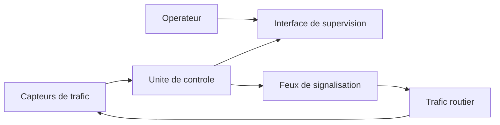
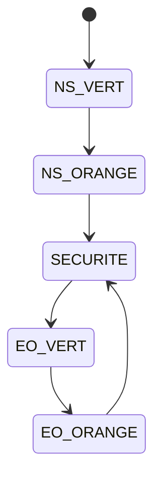
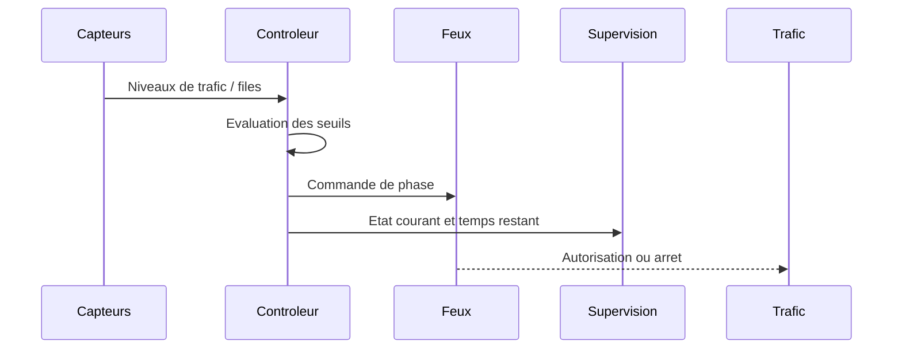
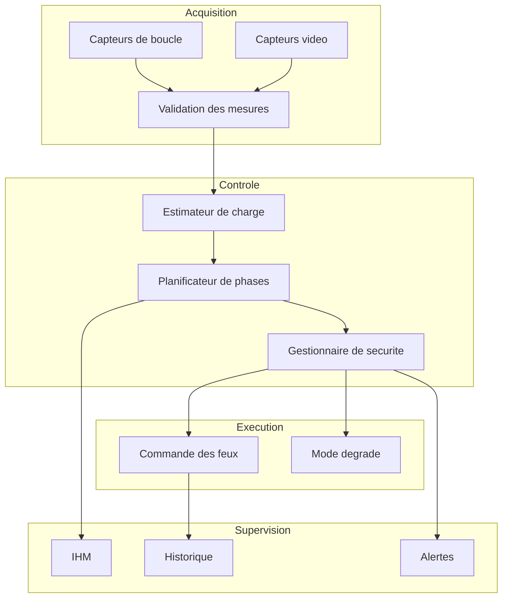

# Specification, modelisation et conception d'un systeme de controle de trafic routier au rond-point Ngaba

## 1. Introduction

Le rond-point Ngaba constitue un noeud important du trafic urbain de Kinshasa. Il relie des
axes tres frequentes et supporte des flux heterogenes: voitures particulieres, taxis, bus,
minibus et poids lourds. Dans la situation actuelle, l'engorgement peut devenir important,
notamment aux heures de pointe.

L'objectif du projet est d'etudier et de concevoir un systeme temps reel de gestion du trafic
base sur des feux de signalisation afin d'ameliorer la fluidite, reduire les temps d'attente et
maintenir un niveau de securite acceptable pour tous les usagers.

Ce document joue le role de dossier academique de:

1. etude du besoin,
2. specification du systeme,
3. modelisation fonctionnelle et comportementale,
4. conception logique et logicielle,
5. plan de validation,
6. mise en relation avec le prototype C++/Qt du depot.

## 2. Problematique

Le rond-point Ngaba presente plusieurs difficultes typiques d'un grand carrefour urbain:

- flux vehiculaires eleves et variables dans le temps,
- concurrence entre plusieurs axes majeurs,
- saturation possible d'une ou plusieurs branches,
- risque de blocage du carrefour quand les usagers s'engagent sans possibilite de sortie,
- heterogeneite des vehicules et des comportements de conduite,
- besoin de coordination fiable entre capteurs, controleur et feux.

La question centrale est la suivante:

Comment concevoir un systeme de controle de trafic temps reel capable d'observer le niveau
de congestion, de choisir une phase de feux adaptee, de garantir la securite des usagers et
d'ameliorer les performances globales du carrefour?

## 3. Objectifs du systeme

### 3.1 Objectif general

Concevoir un systeme temps reel de regulation du trafic au rond-point Ngaba afin de
minimiser l'engorgement et d'optimiser la circulation.

### 3.2 Objectifs specifiques

- reguler l'acces au carrefour par feux tricolores,
- mesurer ou estimer l'etat du trafic sur chaque branche,
- adapter la duree des phases en fonction de la congestion,
- eviter les conflits entre mouvements incompatibles,
- garantir un temps de securite entre deux phases,
- fournir une supervision visuelle de l'etat du systeme,
- permettre une extension future vers un controle plus fin par voie ou par mouvement.

## 4. Perimetre et hypotheses

### 4.1 Perimetre

Le systeme traite:

- l'observation du trafic en amont du rond-point,
- la commande des feux de signalisation,
- la logique de changement de phase,
- la visualisation de l'etat du carrefour,
- l'evaluation de performances de regulation.

Le systeme ne traite pas encore:

- la detection pietonne reelle,
- la communication V2X,
- la coordination avec d'autres carrefours voisins,
- le pilotage d'equipements physiques reels,
- l'integration active d'un simulateur externe comme `SUMO` dans la boucle principale,
- la tolerance aux pannes de type industrielle certifiee.

### 4.2 Hypotheses de travail

Pour rendre la conception tractable dans un cadre academique, on adopte les hypotheses
suivantes:

- le carrefour est ramene a quatre branches principales,
- une branche dominante correspond a l'axe By-Pass,
- une branche importante correspond a l'axe de l'Universite,
- les mouvements sont regles par groupes compatibles,
- les capteurs fournissent une estimation du nombre de vehicules en attente,
- le systeme de commande est centralise,
- les horloges locales sont supposees fiables a l'echelle du prototype.

## 5. Etude du besoin

### 5.1 Acteurs

- Conducteur: attend une circulation plus fluide et plus sure.
- Operateur de supervision: observe l'etat du carrefour et du controleur.
- Service technique: configure les seuils et maintient les equipements.
- Autorite de voirie: definit les politiques de regulation.

### 5.2 Besoins fonctionnels metier

- detecter les files d'attente sur chaque axe,
- accorder un droit de passage a un groupe de voies,
- alterner entre groupes de mouvements incompatibles,
- allonger ou raccourcir la duree d'une phase selon la congestion,
- afficher l'etat des feux et des files,
- conserver un comportement sur entrees en concurrence.

### 5.3 Contraintes majeures

- la securite prime sur la fluidite,
- deux flux incompatibles ne doivent jamais etre verts simultanement,
- un temps intermediaire doit separer deux phases,
- le systeme doit rester comprehensible et supervisable,
- la strategie doit rester stable, meme en congestion forte.

## 6. Specification fonctionnelle

### 6.1 Exigences fonctionnelles

- `EF-01` Le systeme doit representer les branches du rond-point et leurs niveaux de trafic.
- `EF-02` Le systeme doit piloter au moins un feu tricolore par groupe d'acces.
- `EF-03` Le systeme doit definir un cycle de phases avec etats vert, orange et securite.
- `EF-04` Le systeme doit mesurer ou estimer la charge de trafic sur chaque axe.
- `EF-05` Le systeme doit adapter la duree du vert lorsque la congestion depasse un seuil.
- `EF-06` Le systeme doit empecher les conflits de mouvements.
- `EF-07` Le systeme doit exposer une visualisation de la situation courante.
- `EF-08` Le systeme doit permettre l'arret manuel de la simulation.
- `EF-09` Le systeme doit pouvoir fonctionner en mode boucle pour l'etude des scenarios.
- `EF-10` Le systeme doit fournir les informations minimales de supervision: phase active,
temps restant, cycle, files estimees.

### 6.2 Exigences non fonctionnelles

- `ENF-01` Le comportement doit etre deterministe a l'echelle du cycle de commande.
- `ENF-02` Le systeme doit etre modulaire pour faciliter les evolutions.
- `ENF-03` Le systeme doit etre lisible et maintenable par une equipe etudiante.
- `ENF-04` Le systeme doit pouvoir etre simule sur une machine standard.
- `ENF-05` La visualisation doit etre suffisamment expressive pour expliquer le fonctionnement.
- `ENF-06` Les parametres critiques doivent etre centralisables et facilement modifiables.

### 6.3 Exigences de surete

- `ES-01` Une seule famille de mouvements incompatibles peut etre autorisee a la fois.
- `ES-02` Une phase orange doit preceder la fermeture d'un vert.
- `ES-03` Une phase de securite tout rouge doit exister entre deux familles de mouvements.
- `ES-04` En cas d'etat incoherent, le systeme doit revenir a un etat sur.
- `ES-05` En systeme reel, un mode degrade clignotant orange ou tout rouge doit etre prevu.

## 7. Specification temporelle

Dans une implementation temps reel cible, on peut retenir l'organisation suivante:

- periode d'acquisition capteurs: 250 ms,
- periode de mise a jour de supervision: 250 ms a 500 ms,
- periode de decision de controle: 1 s,
- duree minimale de vert: 10 s,
- duree nominale de vert: 15 s,
- duree maximale de vert: 20 s,
- duree orange: 3 s,
- duree de securite tout rouge: 1 s.

Le prototype C++/Qt respecte une echelle logique de temps, mais ne constitue pas une preuve
de respect strict des contraintes temps reel d'une plateforme embarquee.

## 8. Modelisation du systeme

### 8.1 Vue de contexte



### 8.2 Modele conceptuel

Les principales entites sont:

- `Branche`: entree du rond-point,
- `File`: nombre de vehicules en attente,
- `Capteur`: source d'estimation de la file,
- `Phase`: etat de commande des feux,
- `Controleur`: composant qui choisit la phase suivante,
- `Supervision`: interface d'affichage et de suivi.

### 8.3 Modele des etats

Le controle adopte ici une machine a etats finis.



Dans une version plus complete, `SECURITE` pourrait rediriger vers plusieurs sous-phases selon
le mouvement suivant, la presence d'une priorite transport public ou le taux de congestion.

### 8.4 Modele comportemental simplifie



### 8.5 Modele de donnees minimal

Le prototype manipule actuellement:

- `phase`: etat courant des feux,
- `derniere_phase_verte`: memorisation pour l'alternance,
- `trafic["NS"]`: charge agragee sur un axe,
- `trafic["EO"]`: charge agragee sur l'autre axe,
- `temps_restant`: duree restante de la phase.

Ce modele est suffisant pour une maquette, mais insuffisant pour un jumeau numerique realiste
du rond-point Ngaba.

## 9. Conception du systeme

### 9.1 Architecture logique cible

Une architecture cible raisonnable est la suivante:

1. Couche acquisition:
   lecture des capteurs, validation des donnees, filtrage.
2. Couche decision:
   calcul du plan de feux, gestion des seuils, arbitrage des priorites.
3. Couche commande:
   emission des ordres vers les feux et respect des temporisations de securite.
4. Couche supervision:
   visualisation, journalisation, alarmes, statistiques.

### 9.2 Architecture logicielle du prototype actuel

Le depot contient deja une premiere decomposition:

- `src/TrafficModel.*`: logique metier des phases, mouvements, files et durees adaptatives,
- `src/SimulationEngine.*`: orchestration de la simulation et evolution temporelle,
- `src/IntersectionWidget.*`: interface graphique et rendu du carrefour,
- `src/MainWindow.*`: assemblage de la fenetre principale et des interactions utilisateur,
- `src/main.cpp`: lancement de l'application.

Cette architecture est correcte pour une maquette, mais pas encore pour un systeme cible
industrialise. Il manque notamment:

- une vraie abstraction `Capteur`,
- une abstraction `ControleurTempsReel`,
- un composant `Journalisation`,
- un composant `Configuration`,
- une separation plus nette entre simulation, logique metier et presentation.

### 9.2.1 Place de SUMO dans le travail

`SUMO` peut etre utilise comme outil externe de simulation du trafic pour enrichir ou
valider le prototype Ngaba. Dans ce travail, il ne constitue pas le moteur principal de
l'application, qui reste implemente en `C++/Qt`.

Son interet dans le cadre du projet est le suivant:

- comparer le comportement du prototype a une simulation microscopique specialisee ;
- preparer des scenarios de trafic plus riches pour la validation ;
- envisager une extension future vers une co-simulation ou un export de scenarios.

### 9.3 Proposition de decomposition cible



## 10. Algorithme de controle propose

### 10.1 Strategie retenue

La strategie de base du projet est une commande adaptative simple:

1. observer la file sur chaque axe,
2. appliquer une phase verte a une famille de mouvements,
3. prolonger le vert si la file depasse un seuil,
4. passer a l'orange,
5. imposer une phase de securite tout rouge,
6. autoriser l'autre famille de mouvements.

### 10.2 Pseudo-code

```text
initialiser phase <- NS_VERT
tant que systeme actif:
    lire les capteurs
    estimer les files
    si phase verte et congestion forte:
        prolonger dans la limite autorisee
    afficher l'etat courant
    decremeter le temps restant
    si temps restant == 0:
        phase <- phase suivante
        recalculer la duree de phase
```

### 10.3 Avantages

- simple a expliquer,
- simple a implementer,
- facile a simuler,
- base correcte pour un projet academique.

### 10.4 Limites

- peu sensible aux mouvements reellement distincts,
- pas de priorite transport public,
- pas d'anticipation,
- pas d'optimisation globale,
- pas de prise en compte explicite des blocages de sortie.

## 11. Prise en compte du caractere temps reel

Pour qu'on puisse parler d'un systeme temps reel de maniere plus rigoureuse, il faut definir:

- les taches periodiques,
- leurs periodes,
- leurs echeances,
- la politique d'ordonnancement,
- les actions en cas de retard,
- les etats de securite en cas de panne.

### 11.1 Taches candidates

- tache `AcquisitionCapteurs`,
- tache `EvaluationTrafic`,
- tache `DecisionPhase`,
- tache `CommandeFeux`,
- tache `Supervision`,
- tache `Journalisation`.

### 11.2 Exemple d'ordonnancement

- `AcquisitionCapteurs`: periode 250 ms,
- `EvaluationTrafic`: periode 1 s,
- `DecisionPhase`: periode 1 s,
- `CommandeFeux`: evenementielle et supervisee,
- `Supervision`: periode 500 ms,
- `Journalisation`: periode 1 s ou evenementielle.

### 11.3 Politique de securite

En cas d'incoherence capteurs ou de defaut de commande:

1. couper toute nouvelle autorisation conflictuelle,
2. forcer un etat tout rouge,
3. emettre une alerte de supervision,
4. basculer en mode degrade,
5. permettre l'intervention humaine.

## 12. Correspondance avec le prototype existant

### 12.1 Ce qui est deja bien realise

- cycle de feux avec etats principaux,
- durees de phase parametrables,
- adaptation simple par seuil de congestion,
- boucle de simulation,
- visualisation graphique du carrefour,
- maquette visuelle inspiree du rond-point Ngaba.

### 12.2 Ce qui reste partiel

- le trafic est agrege en deux axes seulement,
- les capteurs sont simules par des tirages aleatoires,
- il n'existe pas de journal de performance,
- il n'y a pas de tests automatiques,
- il n'y a pas encore de modele de panne,
- la logique de controle n'est pas encore factorisee en classes metier.

### 12.3 Cartographie code / conception

- `src/TrafficModel.*`: correspond principalement a la couche decision et au modele metier.
- `src/SimulationEngine.*`: correspond a l'orchestration du scenario de simulation.
- `src/IntersectionWidget.*`: correspond a la supervision graphique locale.
- `src/MainWindow.*` et `src/main.cpp`: correspondent au point d'entree et a l'assemblage de l'application.

## 13. Plan de validation

### 13.1 Indicateurs

Pour juger objectivement le systeme, il faut mesurer:

- temps moyen d'attente par axe,
- longueur maximale de file,
- debit moyen de sortie,
- nombre de cycles necessaires pour resorber une congestion,
- taux d'occupation du carrefour,
- nombre de conflits evitables,
- stabilite des changements de phase.

### 13.2 Scenarios de test

- trafic equilibre sur tous les axes,
- axe By-Pass dominant,
- axe de l'Universite dominant,
- surcharge simultanee de deux axes,
- trafic faible,
- panne capteur,
- fermeture manuelle ou arret de supervision.

### 13.3 Criteres d'acceptation academiques

Le projet peut etre considere comme satisfaisant si:

- le modele de phases est coherent,
- les contraintes de securite sont formellement posees,
- les choix d'architecture sont justifies,
- la simulation montre un comportement stable,
- les limites du prototype sont clairement explicitees.

## 14. Limites et ameliorations recommandees

### 14.1 Limites du prototype courant

- reduction du site a une abstraction 4 branches,
- absence de donnees terrain mesurees,
- absence de calibration sur observations reelles,
- simplification excessive des files et mouvements,
- absence de persistance des donnees,
- absence de tests unitaires et de campagnes de simulation statistiques.

### 14.2 Evolutions recommandees

1. passer d'un modele a 2 axes a un modele par branche et par mouvement,
2. introduire des capteurs virtuels par voie,
3. enregistrer les statistiques de performance,
4. ajouter un mode degrade et des alarmes,
5. separer la logique en classes ou services,
6. ajouter des tests automatiques,
7. produire des diagrammes UML complementaires,
8. calibrer les parametres sur observations terrain.

## 15. Conclusion

Le projet actuel constitue une base correcte de prototype pedagogique pour un systeme de
controle de trafic au rond-point Ngaba. Il comporte deja une logique de phases, une regulation
adaptative simple et une visualisation interpretable.

Cependant, pour repondre completement au sujet "Specification, modelisation et conception
d'un systeme de controle de trafic routier au rond-point Ngaba", il faut completer la partie
documentaire et conceptuelle. Le present dossier remplit cette fonction en explicitant le besoin,
les exigences, les hypotheses, la modelisation, l'architecture cible, le comportement temporel
et les criteres de validation.

En l'etat, on peut dire que le depot contient:

- une maquette logicielle fonctionnelle,
- un dossier de conception coherent,
- une base exploitable pour une soutenance ou un rapport,
- mais pas encore un systeme industriel complet.

## 16. Suite de travail recommandee

Ordre de priorite recommande:

1. ajouter un module de statistiques,
2. ajouter des tests,
3. separer le controleur en composant dedie,
4. affiner le modele Ngaba,
5. produire une version finale du rapport avec page de garde et conclusion academique.
