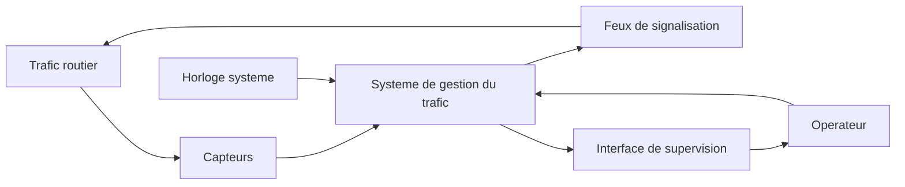
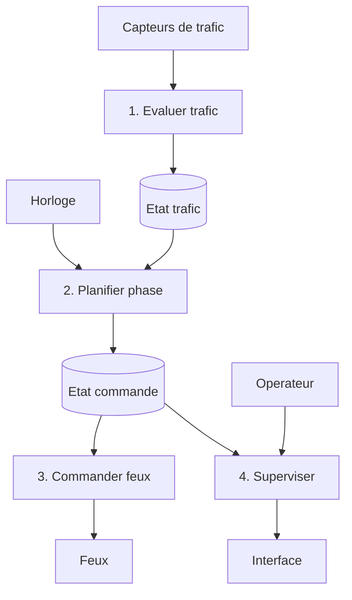
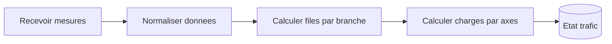
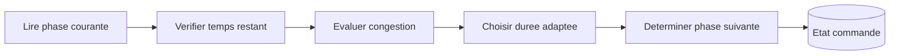
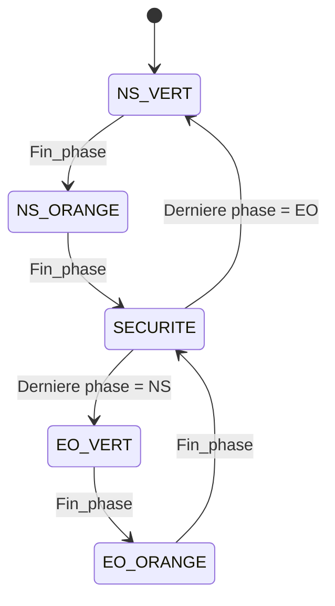

# Specification du systeme selon la methode SA-RT

## 1. Objet

Ce document presente une specification du systeme de gestion du trafic du rond-point
Ngaba selon l'esprit de la methode SA-RT, en distinguant:

- l'analyse fonctionnelle,
- l'analyse operationnelle,
- les flux de donnees,
- les flux de controle,
- les traitements associes.

## 2. Rappel du besoin

Le systeme doit observer le trafic, choisir une phase de circulation compatible,
adapter la duree des feux et afficher l'etat courant du carrefour.

## 3. Frontiere du systeme

Le systeme considere les elements externes suivants:

- Trafic routier,
- Capteurs de trafic,
- Operateur de supervision,
- Feux de signalisation,
- Horloge systeme.

## 4. Diagramme de contexte SA-RT



## 5. Analyse fonctionnelle

### 5.1 Fonctions principales

- FA-01: Acquerir les informations de trafic.
- FA-02: Evaluer les charges de circulation.
- FA-03: Determiner la phase de feux a appliquer.
- FA-04: Gerer les transitions de securite.
- FA-05: Commander les feux.
- FA-06: Mettre a jour la supervision.
- FA-07: Conserver un comportement stable en boucle de simulation.

### 5.2 Entrees fonctionnelles

- estimation des files par branche,
- etat courant des mouvements,
- temps ecoule,
- commande de demarrage ou d'arret,
- parametres de duree et seuils de congestion.

### 5.3 Sorties fonctionnelles

- etat des feux,
- phase active,
- temps restant,
- informations de supervision,
- mouvements autorises,
- evolution des files simulees.

## 6. Analyse operationnelle

### 6.1 Evenements externes

- EVT-01: arrivee de nouvelles donnees de trafic,
- EVT-02: expiration du temps restant d'une phase,
- EVT-03: detection d'une congestion sur un axe,
- EVT-04: demande de supervision,
- EVT-05: fermeture ou arret de la simulation.

### 6.2 Reactions attendues

- REA-01: recalculer les charges et files,
- REA-02: prolonger une phase verte dans les limites autorisees,
- REA-03: passer a l'orange si le vert se termine,
- REA-04: passer au tout rouge de securite,
- REA-05: activer la famille de mouvements suivante,
- REA-06: redessiner la scene de supervision.

## 7. DFD de niveau 0



## 8. DFD de niveau 1

### 8.1 Decomposition du traitement `Evaluer trafic`



### 8.2 Decomposition du traitement `Planifier phase`



## 9. Flux de donnees

### 9.1 Principaux flux

- FD-01 `MesuresTrafic`: donnees brutes ou simulees sur les entrees.
- FD-02 `EtatTrafic`: files et charges agregees.
- FD-03 `CommandePhase`: phase courante, prochaine phase, temps restant.
- FD-04 `EtatFeux`: couleur active par acces.
- FD-05 `VueSupervision`: informations a afficher dans l'IHM.

### 9.2 Dictionnaire de donnees

`MesuresTrafic`
: ensemble des volumes observes ou simules par branche et mouvement.

`EtatTrafic`
: structure contenant les nombres de vehicules par mouvement et les regroupements par axe.

`CommandePhase`
: structure contenant `phase`, `derniere_phase_verte`, `temps_restant`, `duree_phase`.

`EtatFeux`
: structure logique associant a chaque acces l'etat `VERT`, `ORANGE` ou `ROUGE`.

`VueSupervision`
: ensemble de donnees destinees a l'affichage graphique.

## 10. Flux de controle

### 10.1 Evenements de controle

- FC-01 `Tick_1s`
- FC-02 `Fin_phase`
- FC-03 `Congestion_NS`
- FC-04 `Congestion_EO`
- FC-05 `Fermeture_supervision`

### 10.2 Table simplifiee de controle

| Evenement | Condition | Action |
| --- | --- | --- |
| `Tick_1s` | phase active | decrementer le temps restant |
| `Congestion_NS` | phase = `NS_VERT` | prolonger dans la limite max |
| `Congestion_EO` | phase = `EO_VERT` | prolonger dans la limite max |
| `Fin_phase` | phase = `NS_VERT` | passer a `NS_ORANGE` |
| `Fin_phase` | phase = `NS_ORANGE` | passer a `SECURITE` |
| `Fin_phase` | phase = `EO_VERT` | passer a `EO_ORANGE` |
| `Fin_phase` | phase = `EO_ORANGE` | passer a `SECURITE` |
| `Fin_phase` | phase = `SECURITE` | activer la famille opposee |

## 11. CSPEC simplifie

Le comportement de controle peut etre represente comme une machine a etats:



## 12. PSPEC simplifie

### 12.1 Traitement `Evaluer trafic`

```text
Recevoir les volumes par mouvement
Normaliser les valeurs
Calculer les files par branche
Calculer les charges par axe
Produire l'etat trafic
```

### 12.2 Traitement `Planifier phase`

```text
Lire la phase courante et le temps restant
Si congestion forte sur l'axe vert:
    prolonger la duree dans la limite maximale
Sinon:
    conserver la duree nominale
Quand le temps restant atteint zero:
    choisir la phase suivante selon la sequence sure
```

### 12.3 Traitement `Superviser`

```text
Lire l'etat des feux
Lire les files, les mouvements et le cycle
Dessiner le fond du carrefour
Afficher les vehicules, feux et informations de contexte
```

## 13. Exigences temporelles

- acquisition logique: 1 seconde dans le prototype,
- mise a jour supervision: a chaque pas de simulation,
- duree minimale de vert: selon parametrage interne,
- duree orange: 3 secondes,
- duree de securite: 1 seconde.

Le prototype est une simulation logique et non une garantie d'execution temps reel dur.

## 14. Limites de la specification actuelle

- les capteurs sont simules et non reels,
- la granularite par voie reste simplifiee,
- les conflits pietons ne sont pas modelises,
- le controle reste base sur deux grandes familles de flux.

## 15. Conclusion

La specification SA-RT du projet montre une analyse fonctionnelle et operationnelle
coherente pour un systeme de regulation du trafic au rond-point Ngaba. Elle sert de
base a la conception DARTS et a l'implementation du simulateur.
